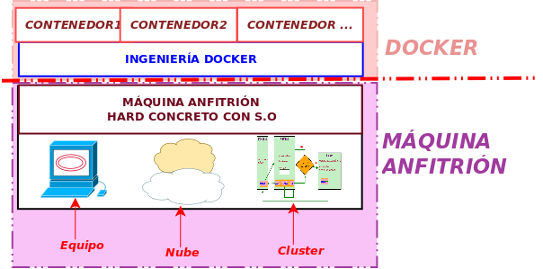


Qué es docker
Imágenes Vs Contenedores
Obtener una imagen: run, pull, search
Crear un contenedor: create, start, stop, rm, run
Arrancar un contenedor: start, run
Detener un contenedor: stop
Eliminar un contenedor vs Imagenes: rm, rmi
Visualizar imágenes y contenedores: images, ps, ps -a
Mapear puertos y volúmenes: -p, -v
Crear una imagen  a partir de un contenedor: commit, build



Docker es una plataforma de virtualización basada en contenedores.



La idea de Docker es ejecutar una o varias aplicaciones en **entornos aislados** (es decir, una forma de virtualizar).  
Esto facilita su despliegue y portabilidad.


*  PUNTOS FUNDAMENTALES 

Asegúrate de leer y entender bien los siguientes párrafos

* La idea es tener  un contenedor (un paquete ejecutable)  que contiene todo lo necesario para ejecutar una aplicación, incluyendo el código, las dependencias y las configuraciones, de forma totalmente aislada del sistema en el cual se está ejecutando. Esto permite que la aplicación se ejecute de manera consistente en cualquier entorno.
* Este archivo contenedor  no incluye un sistema operativo completo propio , pero funciona como si lo tuviera,  ejecutándose de forma aislada e independiente del sistema anfitrión . 
  > Utiliza el kernel del anfitrión y configura los componentes necesarios para simular el entorno del sistema operativo deseado o requerido, aunque siempre dentro del tipo de sistema operativo del anfitrión.
*  Compatibilidad de sistema operativo : Los contenedores dependen del sistema anfitrión, por lo que los contenedores Linux solo se ejecutan en anfitriones Linux. 
  >  Sin embargo, gracias a tecnologías comoc   WSL y Hyper-V , es posible ejecutar contenedores Linux en Windows.
   
  > También existen soluciones emergentes para ejecutar contenedores de Windows en Linux, aunque con limitaciones.


En Linux los contenedores usan directamente el **kernel del anfitrión**.  
En Windows, en cambio, para ejecutar contenedores Linux, Docker utiliza tecnologías como **WSL2** o **Hyper-V**:

* **WSL2 (Windows Subsystem for Linux 2)**: es una compatibilidad de Windows que incluye un **kernel Linux real** integrado, no es exactamente una máquina virtual clásica, sino una capa optimizada para ejecutar Linux dentro de Windows.
* **Hyper-V**: es la plataforma de virtualización de Windows, y en este caso sí funciona como una **máquina virtual ligera** que corre Linux para que los contenedores puedan ejecutarse.




En sistemas  Windows necesitas un “puente” que proporcione un kernel Linux, porque los contenedores siempre dependen de un kernel del mismo tipo que fueron creados.


### El proceso de empaquetado

En Docker, el proceso de empaquetado agrupa el código fuente y todas las dependencias necesarias para que el software funcione, creando una entidad unificada en forma de archivo de contenedor.

Para crear un contenedor necesitamos partir de una plantilla base que contenga lo necesario  para este entorno de ejecución aislada. Esta plantilla la conocemos como  imagen 

Un **contenedor** es, en esencia, una instancia ejecutable que virtualiza el software dentro de un entorno específico.

A partir de un contenedor, se pueden crear imágenes en cualquier momento, permitiendo así capturar el estado del entorno y los cambios realizados.

### Creación y actualización de contenedores

A partir de una imagen específica, es posible iniciar un contenedor de forma muy rápida, en cuestión de segundos o menos.

Si realizamos cambios en el contenedor, estos se guardan en capas incrementales, lo que permite visualizar los cambios y restaurar versiones anteriores del entorno, si es necesario.

[//]: # (### Docker Vs Máquinas virtuales)

[//]: # (<iframe src="https://docs.google.com/presentation/d/e/2PACX-1vS6zxmUEE9zmd10c_6vLNf2bTaI_BoVCkVukwHcnBO0S3lm_NVU_YU9sJcUpCItLKyKCACkXrjESfbB/embed?start=false&loop=false&delayms=3000" frameborder="0" width="960" height="569" allowfullscreen="true" mozallowfullscreen="true" webkitallowfullscreen="true"></iframe>)

