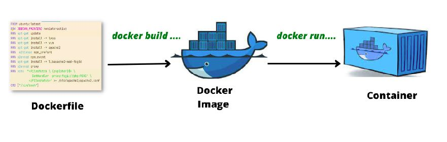
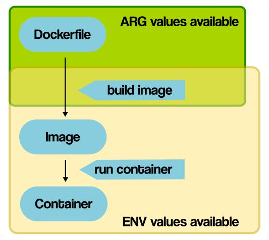
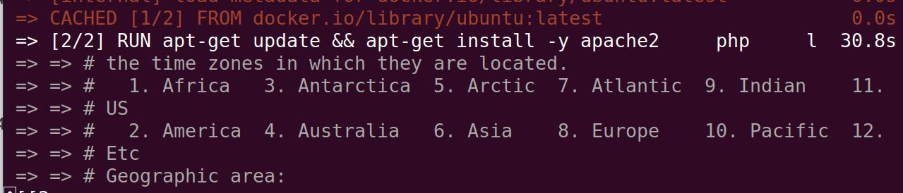


Un  Dockerfile  es un fichero de texto que contiene una serie de instrucciones para crear una  imagen . 
 
Este fichero tiene un formato concreto y necesita al menos la instrucción  FROM  para especificar la imagen base a partir de la cual construiremos nuestra imagen personalizada.


> * La idea es que partiendo de una imagen  personalicemos la imagen quequeremos crear,
> 
> * Después, a partir de esta imagen, levantaremos el contenedor)

{}

## Construcción del Dockerfile

Para ejecutar las instrucciones del Dockerfile, utilizamos el comando  docker build :


docker build [OPTIONS] PATH | URL | -


Podemos usar la opción  PATH  para especificar la ubicación del Dockerfile. 

 Si el fichero tiene otro nombre , lo indicamos con la opción  -f .

{}

## Instrucciones principales

- **FROM**: Establece la imagen base.
- **RUN**: Ejecuta comandos durante la construcción de la imagen.
- **CMD**: Especifica el comando predeterminado para el contenedor.
- **LABEL**: Añade metadatos a la imagen.
- **EXPOSE**: Define los puertos que se abrirán.
- **ENV**: Establece variables de entorno.
- **COPY** y **ADD**: Copian archivos al contenedor.
- **WORKDIR**: Define el directorio de trabajo.
- **VOLUME**: Crea un punto de montaje persistente.
- **ENTRYPOINT**: Establece el comando principal del contenedor.
- **ARG**: Declara argumentos para la construcción.

{}

## Ejemplo: Imagen base (`FROM`)


FROM ubuntu:latest


Esta instrucción es obligatoria y debe ser la primera, salvo comentarios o  ARG .

{}

## Ejemplo: Ejecución de comandos (`RUN`)

### Instalación de paquetes
### Instalación de paquetes
> *Lo primero que debemos hacer es ejecutar  apt-get update , lo que actualiza las cabeceras de los repositorios para garantizar que los paquetes disponibles estén actualizados.*  
> *Observa que se utiliza la opción  -y  para confirmar automáticamente las instalaciones, evitando la necesidad de interacción manual,  algo que no está permitido durante la construcción del contenedor .*


RUN apt-get update && apt-get install -y apache2
RUN apt-get install -y php git zip


### Ejecución de scripts


RUN bash script.sh


Cada instrucción  RUN  genera una capa.

Modificar una capa afecta a las siguientes, por lo que conviene agrupar comandos para optimizar.

{}

## Declaración de variables: `ENV` y `ARG`

### ENV


FROM ubuntu:latest
ENV USER=developer
RUN echo "Usuario actual: $USER"


### ARG


ARG VERSION=latest
FROM ubuntu:$VERSION
RUN echo "Versión base: $VERSION"


Construcción con argumentos personalizados:


docker build --build-arg VERSION=20.04 -t mi_imagen .

## Ejemplo: Personalización con `RUN`

Podemos ejecutar comandos de administración, instalación y scripts predefinidos:


RUN mkdir -p /var/www/app && chown -R www-data:www-data /var/www/app
RUN apt-get update && apt-get install -y composer
RUN composer install --no-scripts --no-autoloader


{}

## Práctica sugerida: Crear un Dockerfile

1. Partir de la imagen base `ubuntu:latest`.
2. Instalar los paquetes necesarios:
	- `apache2`
	- `vim`
	- `git`
	- `zip`


FROM ubuntu:latest
RUN apt-get update && apt-get install -y apache2 vim git zip


{}

## Declaración de variables: `ENV` vs `ARG`

Diferencias clave:
- **`ENV`**: Define variables accesibles dentro del contenedor en tiempo de ejecución.
- **`ARG`**: Define argumentos disponibles solo durante la construcción de la imagen.

### Ejemplo de uso: `ARG`


ARG VERSION=latest
FROM ubuntu:$VERSION
RUN echo $VERSION > version.txt


Construcción personalizada:


docker build --build-arg VERSION=18.10 -t web:v1 .


### Ejemplo de uso: `ENV`


FROM ubuntu:latest
ENV USER=manuel
RUN echo "Usuario configurado: $USER"


{}

## Solución de problemas: Instalación de PHP

### Problema
Al instalar PHP, puede requerirse configurar la zona horaria (`tzone`), lo que interrumpe la construcción al no poder interactuar con el contenedor.

### Solución
Configurar el entorno en modo no interactivo:


ARG DEBIAN_FRONTEND=noninteractive
RUN apt-get update && apt-get install -y php libapache2-mod-php


Configurar la zona horaria:


RUN ln -snf /usr/share/zoneinfo/Europe/Madrid /etc/localtime && \
echo "Europe/Madrid" > /etc/timezone

{}

## Etiquetas (`LABEL`)

Podemos agregar metadatos útiles a la imagen:


FROM ubuntu:latest
LABEL maintainer="example@example.com"
LABEL version="1.0"
LABEL description="Imagen personalizada para aplicaciones web"


Ver etiquetas en el contenedor:


docker inspect --format '{{.Config.Labels}}' container_name


{}

## Gestión de archivos: `COPY` y `ADD`

### Ejemplo: Crear usuarios desde un script

Archivos necesarios:
1. `usuarios.txt`:
   
   maria
   nives
   luis
   lourdes
   manuel
   

2. `crea_usuarios.sh`:
   
   while IFS= read -r line
   do
   useradd -m $line -p $line
   done < usuarios.txt
   

Dockerfile:


FROM ubuntu:latest
COPY crea_usuarios.sh /
ADD usuarios.txt /
RUN bash crea_usuarios.sh


{}

## Comandos: `CMD` y `ENTRYPOINT`

### `CMD`


CMD ["echo", "Hola desde Docker"]


### `ENTRYPOINT`


ENTRYPOINT ["apachectl", "-D", "FOREGROUND"]


Ambos comandos definen lo que ejecutará el contenedor al iniciarse.

{}

## Volúmenes (`VOLUME`)

Definir un volumen para persistencia de datos:


FROM ubuntu:latest
VOLUME ["/data"]


Uso con variables de entorno:


ENV WEB_DIR=/var/www/html
VOLUME $WEB_DIR


{}

## Directorio de trabajo (`WORKDIR`)

Definir el directorio predeterminado:


FROM ubuntu:latest
WORKDIR /var/www/html
COPY script.sh /
ENTRYPOINT bash script.sh


{}

## Exponer puertos (`EXPOSE`)

Definir puertos expuestos por el contenedor:


FROM ubuntu:latest
ENV WEB_PORT=80 MYSQL_PORT=3306
EXPOSE $WEB_PORT $MYSQL_PORT


{}

## Conclusión


- Sabemos crear imágenes personalizadas con Dockerfile.
- Sabemos usar instrucciones clave como `RUN`, `CMD`, `ENTRYPOINT` y más.
- Aprendimos a gestionar volúmenes y persistencia de datos.
- Configuramos variables de entorno y puertos expuestos.
- Sabemos subir y gestionar imágenes en Docker Hub.
  
