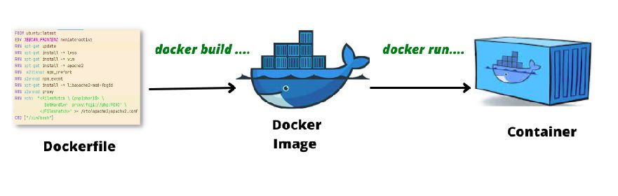
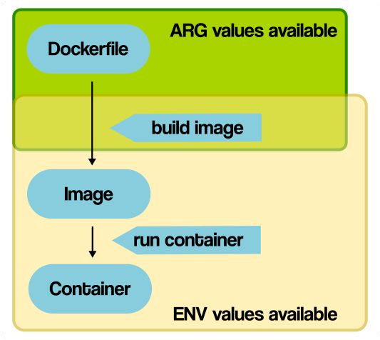
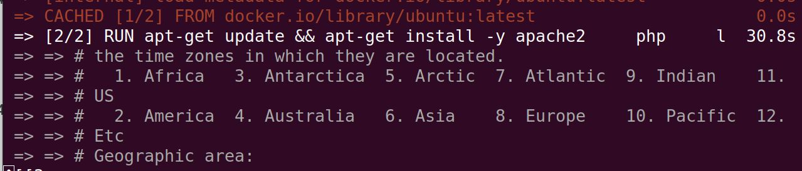


Un  Dockerfile  es un fichero de texto que contiene una serie de instrucciones para crear una  imagen  de Docker.  
 
Este fichero tiene un formato específico y necesita, como mínimo, la instrucción  FROM  para indicar la imagen base a partir de la cual construiremos nuestra propia imagen personalizada.



> * La idea es **partir de una imagen base** y **personalizarla** según nuestras necesidades.
> * Una vez creada la nueva imagen, **podremos utilizarla para levantar contenedores**.
    

{}
## Construcción del Dockerfile

Para ejecutar las instrucciones del Dockerfile, utilizamos el comando  docker build :


docker build [OPTIONS] PATH | URL | -


Podemos usar la opción  PATH  para especificar la ubicación del Dockerfile. 

 Si el fichero tiene otro nombre , lo indicamos con la opción  -f .

{}

## Instrucciones principales

- **FROM**: Establece la imagen base.
- **RUN**: Ejecuta comandos durante la construcción de la imagen.
- **CMD**: Especifica el comando predeterminado para el contenedor.
- **LABEL**: Añade metadatos a la imagen.
- **EXPOSE**: Define los puertos que se abrirán.
- **ENV**: Establece variables de entorno.
- **COPY** y **ADD**: Copian archivos al contenedor.
- **WORKDIR**: Define el directorio de trabajo.
- **VOLUME**: Crea un punto de montaje persistente.
- **ENTRYPOINT**: Establece el comando principal del contenedor.
- **ARG**: Declara argumentos para la construcción.

{}

## Ejemplo: Imagen base (`FROM`)


FROM ubuntu:latest


Esta instrucción es obligatoria y debe ser la primera, salvo comentarios o  ARG .

{}

## Ejemplo: Ejecución de comandos (`RUN`)

### Instalación de paquetes
### Instalación de paquetes
> *Lo primero que debemos hacer es ejecutar  apt-get update , lo que actualiza las cabeceras de los repositorios para garantizar que los paquetes disponibles estén actualizados.*  
> *Observa que se utiliza la opción  -y  para confirmar automáticamente las instalaciones, evitando la necesidad de interacción manual,  algo que no está permitido durante la construcción del contenedor .*


RUN apt-get update && apt-get install -y apache2
RUN apt-get install -y php git zip


### Ejecución de scripts


RUN bash script.sh


Cada instrucción  RUN  genera una capa.

Modificar una capa afecta a las siguientes, por lo que conviene agrupar comandos para optimizar.

{}

## Declaración de variables: `ENV` y `ARG`

### ENV


FROM ubuntu:latest
ENV USER=developer
RUN echo "Usuario actual: $USER"


### ARG


ARG VERSION=latest
FROM ubuntu:$VERSION
RUN echo "Versión base: $VERSION"


Construcción con argumentos personalizados:


docker build --build-arg VERSION=20.04 -t mi_imagen .

## Ejemplo: Personalización con `RUN`

Podemos ejecutar comandos de administración, instalación y scripts predefinidos:


RUN mkdir -p /var/www/app && chown -R www-data:www-data /var/www/app
RUN apt-get update && apt-get install -y composer
RUN composer install --no-scripts --no-autoloader


{}

## Práctica sugerida: Crear un Dockerfile

1. Partir de la imagen base `ubuntu:latest`.
2. Instalar los paquetes necesarios:
	- `apache2`
	- `vim`
	- `git`
	- `zip`


FROM ubuntu:latest
RUN apt-get update && apt-get install -y apache2 vim git zip


{}

## Declaración de variables: `ENV` vs `ARG`

Diferencias clave:
- **`ENV`**: Define variables accesibles dentro del contenedor en tiempo de ejecución.
- **`ARG`**: Define argumentos disponibles solo durante la construcción de la imagen.

### Ejemplo de uso: `ARG`


ARG VERSION=latest
FROM ubuntu:$VERSION
RUN echo $VERSION > version.txt


Construcción personalizada:


docker build --build-arg VERSION=18.10 -t web:v1 .


### Ejemplo de uso: `ENV`


FROM ubuntu:latest
ENV USER=manuel
RUN echo "Usuario configurado: $USER"


{}

## Solución de problemas: Instalación de PHP

### Problema
Al instalar PHP, puede requerirse configurar la zona horaria (`tzone`), lo que interrumpe la construcción al no poder interactuar con el contenedor.

### Solución
Configurar el entorno en modo no interactivo:


ARG DEBIAN_FRONTEND=noninteractive
RUN apt-get update && apt-get install -y php libapache2-mod-php


Configurar la zona horaria:


RUN ln -snf /usr/share/zoneinfo/Europe/Madrid /etc/localtime && \
echo "Europe/Madrid" > /etc/timezone

{}

## Etiquetas (`LABEL`)

Podemos agregar metadatos útiles a la imagen:


FROM ubuntu:latest
LABEL maintainer="example@example.com"
LABEL version="1.0"
LABEL description="Imagen personalizada para aplicaciones web"


Ver etiquetas en el contenedor:


docker inspect --format '{{.Config.Labels}}' container_name


{}

## Gestión de archivos: `COPY` y `ADD`

### Ejemplo: Crear usuarios desde un script

Archivos necesarios:
1. `usuarios.txt`:
   
   maria
   nives
   luis
   lourdes
   manuel
   

2. `crea_usuarios.sh`:
   
   while IFS= read -r line
   do
   useradd -m $line -p $line
   done < usuarios.txt
   

Dockerfile:


FROM ubuntu:latest
COPY crea_usuarios.sh /
ADD usuarios.txt /
RUN bash crea_usuarios.sh


{}

## Comandos: `CMD` y `ENTRYPOINT`

### `CMD`


CMD ["echo", "Hola desde Docker"]


### `ENTRYPOINT`


ENTRYPOINT ["apachectl", "-D", "FOREGROUND"]


Ambos comandos definen lo que ejecutará el contenedor al iniciarse.

{}

## Volúmenes (`VOLUME`)

Define un volumen para la persistencia de datos.
Es una instrucción declarativa que indica que, en los contenedores creados a partir de esta imagen, los datos ubicados en esta carpeta deberían almacenarse de forma persistente en un volumen.


FROM ubuntu:latest
VOLUME ["/var/www/html"]


Uso con variables de entorno:


ENV WEB_DIR=/var/www/html
VOLUME $WEB_DIR


{}

## Directorio de trabajo (`WORKDIR`)

Definir el directorio predeterminado:


FROM ubuntu:latest
WORKDIR /var/www/html
COPY script.sh /
ENTRYPOINT bash script.sh


{}

## Exponer puertos (`EXPOSE`)

Define los puertos que el contenedor utilizará para aceptar conexiones.

Es una instrucción declarativa(en una *instrucción declarativa* indicamos una **intención**, mientras que en una *instrucción activa* realizamos la **acción real**).  
Indica qué puertos estarán disponibles dentro del contenedor, aunque **no los publica automáticamente** en el host.  
Para hacerlos accesibles desde fuera, deben mapearse explícitamente al ejecutar el contenedor, por ejemplo con la opción `-p`.


FROM php:8.3-apache

# El contenedor escuchará internamente en el puerto 80
EXPOSE 80


Ejemplo de uso, (myimage sería la imagen generado por el Dockerfile anterior):


# Publicamos el puerto 80 del contenedor en el 8080 del host
docker run -d -p 8080:80 myimage


El contenedor escucha en el puerto `80`, pero el acceso externo se realiza a través del `8080`.


FROM ubuntu:latest
ENV WEB_PORT=80 
MYSQL_PORT=3306
EXPOSE $WEB_PORT $MYSQL_PORT


{}

## Extensiones de PHP en Docker (`docker-php-ext-*`)

Las imágenes oficiales de PHP incluyen herramientas para **gestionar extensiones** de forma sencilla.

Estas utilidades permiten **compilar, activar, configurar o instalar extensiones adicionales** directamente dentro del contenedor durante el proceso de construcción de la imagen.

De este modo, puedes añadir soporte para bases de datos (`pdo_mysql`, `mysqli`), gráficos (`gd`), internacionalización (`intl`), depuración (`xdebug`), cachés (`redis`, `apcu`) u otras librerías sin necesidad de compilar PHP manualmente.

Es una **instrucción activa**, ya que **ejecuta acciones reales** durante la construcción de la imagen (instala o habilita extensiones).

---

 Comandos principales

| Comando | Función principal | Tipo |
|----------|------------------|------|
| `docker-php-ext-install` | Compila e instala extensiones incluidas en el código fuente de PHP (por ejemplo `pdo_mysql`, `gd`, `intl`) | Activa |
| `docker-php-ext-enable` | Activa extensiones ya instaladas, normalmente tras usar `pecl install` | Activa |
| `docker-php-ext-configure` | Configura opciones previas a la compilación de una extensión | Activa |
| `pecl install` | Instala extensiones externas (no incluidas en el core de PHP) | Activa |

---

### 🧱 Ejemplo básico


FROM php:8.3-apache

# Instalar extensiones PHP nativas
RUN docker-php-ext-install mysqli pdo pdo_mysql


---

### 🌍 Ejemplo con dependencias


FROM php:8.3-apache

# Instalar librerías del sistema necesarias
RUN apt-get update && apt-get install -y \
libjpeg-dev libpng-dev libwebp-dev libfreetype6-dev \
&& docker-php-ext-configure gd --with-jpeg --with-webp --with-freetype \
&& docker-php-ext-install gd mysqli pdo pdo_mysql intl \
&& docker-php-ext-enable gd

# Limpieza para reducir tamaño de la imagen
RUN apt-get clean && rm -rf /var/lib/apt/lists/*


---

### 💡 Notas

- Estas herramientas solo están disponibles en las **imágenes oficiales de PHP** (`php:8.3-apache`, `php:8.3-fpm`, etc.).
- Es recomendable **limpiar la caché** y **combinar comandos** en una sola capa para reducir el tamaño final de la imagen.
- Si la extensión no está incluida en PHP, puede instalarse mediante `pecl install nombre` y activarse con `docker-php-ext-enable`.

---

👉 En resumen, estas utilidades facilitan la instalación y configuración de extensiones PHP durante la construcción de imágenes Docker, de forma similar a cómo `apt-get install` gestiona paquetes del sistema.

## Conclusión


- Sabemos crear imágenes personalizadas con Dockerfile.
- Sabemos usar instrucciones clave como `RUN`, `CMD`, `ENTRYPOINT` y más.
- Aprendimos a gestionar volúmenes y persistencia de datos.
- Configuramos variables de entorno y puertos expuestos.
- Sabemos subir y gestionar imágenes en Docker Hub.
  
