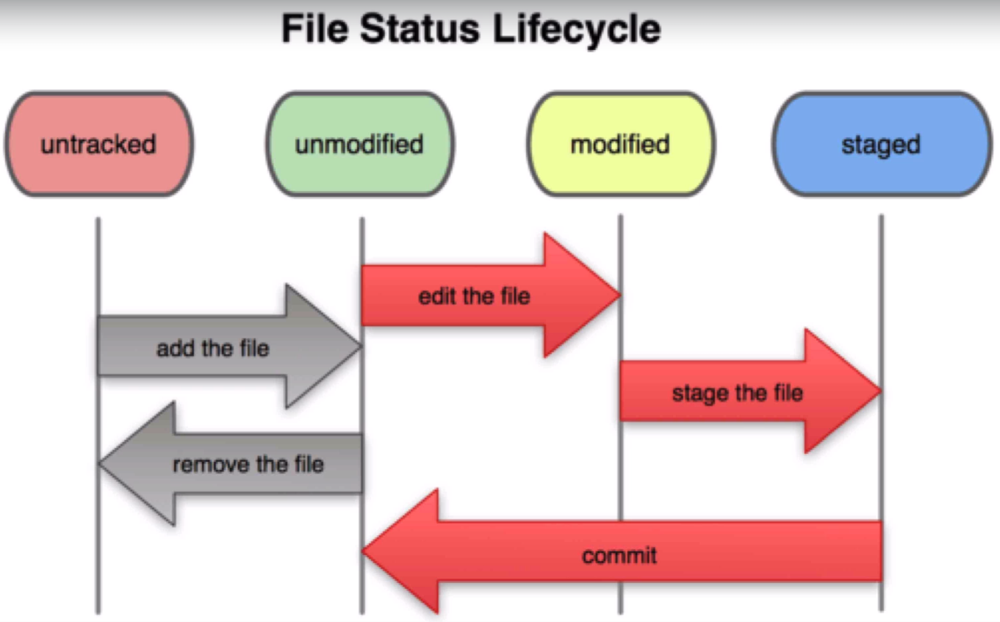
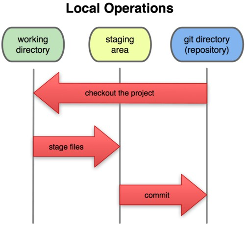

# **Instalación y configuración básica de Git en Ubuntu**

Para comenzar a trabajar con Git en Ubuntu, necesitamos instalarlo y configurarlo correctamente.

## **1. Instalación de Git

Para instalar Git en Ubuntu, ejecuta los siguientes comandos en la terminal:


sudo apt update
sudo apt install git


Una vez instalado, verifica la versión con:


git --version


{}

## 2. Configuración inicial de Git

Lo primero que debemos hacer  es configurar una variables de entorno de git que establece tus datos (name y email es obligatorio)  
Esto es necesario porque Git usa esta información en cada commit que hagas.

Para ello ejecutaremos  los siguientes comandos,


git config --global user.name "Tu Nombre"
git config --global user.email "tu@email.com"


Para comprobar la configuración actual:


git config --list


Esta configuración se guarda en el archivo `~/.gitconfig`.

Si deseas cambiar el editor por defecto de Git, puedes hacerlo con:


git config --global core.editor "nano"
git config --global core.editor "gedit"
git config --global core.editor "code --wait"  # Para Visual Studio Code


{}

## 3. Obtener ayuda en Git

Si necesitas ayuda sobre un comando específico, usa:


git help <comando>


Ejemplo:


git help commit


Esto abrirá la documentación oficial de Git para ese comando.

{}

## Trabajando con Git en local

### Ciclo de vida de los archivos en Git

En un repositorio Git, los archivos pueden estar en uno de estos estados siguientes:


* **Untracked (Sin seguimiento):** Archivos nuevos que Git aún no rastrea.  
* **Tracked (En seguimiento):** Archivos añadidos a Git y monitorizados para cambios.  
* **Modified (Modificado):** Archivos editados pero aún no preparados para commit.  
* **Staged (Preparado):** Archivos listos para ser confirmados.  
* **Committed (Confirmado):** Archivos guardados en el historial del repositorio.  


####  Las tres áreas en Git
Para gestionar estos estados, Git usa tres áreas principales:

1. **Directorio de trabajo (Working Directory)** → Donde editas los archivos.  
2. **Área de preparación (Staging Area)** → Zona intermedia antes de confirmar cambios.  
3. **Repositorio de Git (Git Directory)** → Base de datos donde se almacenan las versiones confirmadas.

{}

## Comandos esenciales en Git

*  Inicializar un repositorio Git 
Para empezar a usar Git en un proyecto, ejecuta:


git init


Esto creará una carpeta `.git` en tu proyecto, donde se almacenará la información del repositorio.

{}

 Agregar archivos a Git 
Cuando creas un nuevo archivo, Git **no lo sigue automáticamente**. Para rastrear un archivo:


git add nombre_archivo


Para agregar **todos los archivos**:


git add .


{}

*  Ver el estado del repositorio** 
Para ver el estado actual de los archivos:


git status


Esto te dirá qué archivos están sin seguimiento, modificados o listos para confirmarse.

{}

*  Confirmar cambios 
Para guardar los cambios en el historial de Git:


git commit -m "Mensaje descriptivo del cambio"


Si quieres **evitar usar `git add` manualmente**, usa:


git commit -a -m "Mensaje descriptivo del cambio"


Esto **agrega y confirma** los archivos en un solo paso.

{}

 Ignorar archivos en Git 
Si hay archivos que **no quieres versionar** (logs, configuraciones locales, etc.), usa un archivo **.gitignore**.

Ejemplo de `.gitignore`:


*.log
node_modules/
.env


Esto hará que Git **ignore esos archivos** y no los agregue al repositorio.

{}

 Comparar diferencias entre versiones 
Si quieres ver qué ha cambiado en tu código antes de confirmar:


git diff


Si ya agregaste los cambios a la **staging area** y quieres ver las diferencias antes del commit:


git diff --staged


---
