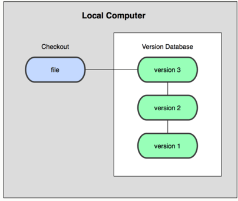
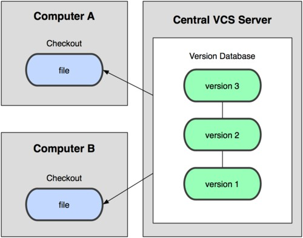
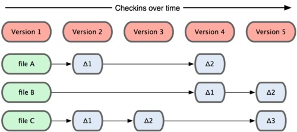
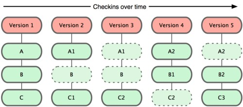


Entender qué es git



> https://www.w3schools.com/git/default.asp


# Conceptos de Git


Git es una herramienta fundamental para el control de versiones en desarrollo de software.


## ¿Qué es Git?

 Git  es un **sistema de control de versiones** distribuido que permite a los desarrolladores gestionar cambios en su código de manera eficiente. No depende de servidores centralizados, pero _puede usarse junto a plataformas como GitHub_, GitLab o Bitbucket  para almacenar y compartir repositorios de código versionado en la nube .

## Tipos de control de versiones y características

### 1. Sistemas de Control de Versiones Local

Un método común de control de versiones consiste en copiar archivos a otro directorio con la fecha y hora en el nombre. Aunque es simple, **es altamente propenso a errores**.

Una mejor alternativa es utilizar una **base de datos local** que registre cada cambio realizado en los archivos. Sin embargo, esta solución no permite la colaboración entre múltiples usuarios.

### 2. Sistemas de Control de Versiones Centralizados (CVCS)

Para solucionar el problema de la colaboración, surgieron los **sistemas de control de versiones centralizados** (CVCS), como **CVS, Subversion y Perforce**. En estos sistemas:

- Un **servidor central** almacena la base de datos con el historial de versiones.
- Los desarrolladores descargan y suben archivos al servidor.
- Los administradores pueden controlar los permisos de los usuarios.

 Ventajas 

✅ Todos los desarrolladores pueden ver en qué están trabajando los demás.  
✅ Es más fácil administrar un repositorio centralizado.  
✅ Se pueden gestionar permisos y accesos.  


 Desventajas 

⚠️ **Punto único de fallo**: Si el servidor central falla, nadie puede trabajar.  
⚠️ **Riesgo de pérdida total**: Si el servidor se corrompe y no hay copias de seguridad, se pierde todo el historial del proyecto.  


**Ejemplo de un CVCS:**
{}

En la imagen, **varias computadoras acceden a un servidor central**, donde se almacenan todas las versiones del código. Si el servidor deja de funcionar, nadie puede acceder a los archivos.

### 3. Sistemas de Control de Versiones Distribuidos (DVCS)

Los **sistemas de control de versiones distribuidos (DVCS

 Características principales 

- **Distribuido**: Cada copia del repositorio es un repositorio completo, lo que permite trabajar sin conexión.
- **Eficiencia**: Usa técnicas avanzadas de compresión y almacenamiento para gestionar grandes proyectos.
- **Seguridad**: Protege la integridad de los datos mediante sumas de verificación SHA-1.
- **Velocidad**: Es mucho más rápido que otros sistemas de control de versiones como SVN o CVS.





### Introducción a Git

En **2005**, la comunidad que desarrollaba el núcleo de Linux perdió el acceso gratuito a **BitKeeper**, la herramienta que utilizaban para el control de versiones. Esta situación llevó a **Linus Torvalds**, creador de Linux, a desarrollar una **nueva herramienta** basada en las lecciones aprendidas con **BitKeeper**.

Así nació **Git**, con los siguientes objetivos principales:

* **Velocidad**  
* **Diseño sencillo**  
* **Soporte para desarrollo no lineal** (múltiples ramas paralelas)  
* **Completamente distribuido**  
* **Capaz de manejar grandes proyectos** de manera eficiente  

Desde su creación en 2005, **Git ha evolucionado** para ser una herramienta fácil de usar sin perder sus cualidades iniciales. Se ha convertido en una de las herramientas más populares del mundo debido a su:

- **Rapidez** 
- **Eficiencia en proyectos grandes** 
- **Sistema avanzado de ramificación (branching)** 

Hoy en día, **Git es el estándar en control de versiones** y es utilizado por millones de desarrolladores en todo el mundo. 
{}

### Fundamentos de Git**

####1. Instantáneas, no diferencias**

A diferencia de otros sistemas como **CVS** o **Subversion**, que almacenan los datos como cambios respecto a una versión base, **Git funciona con instantáneas**.

Cada vez que confirmas un cambio, Git **toma una foto** del estado de todos los archivos en ese momento. Si un archivo no ha cambiado, en lugar de almacenarlo de nuevo, **Git simplemente crea un enlace a la versión anterior**.

#### 2. Casi cualquier operación es local**

En **Git**, la mayoría de las operaciones solo requieren archivos locales, sin necesidad de acceder a un servidor. Esto lo hace extremadamente rápido y eficiente.

🔹 **Ventajas de operar localmente en Git**:
- Puedes ver el historial del proyecto sin conexión.
- Puedes hacer comparaciones entre versiones sin depender de un servidor.
- Si te quedas sin conexión, puedes seguir trabajando y luego subir los cambios cuando sea posible.

{}

#### 3. Git tiene integridad

Git verifica **todo** mediante **suma de comprobación** (**checksum**), garantizando que **no se pueden alterar archivos sin que el sistema lo detecte**.

El método utilizado es el **hash SHA-1**, una cadena única de 40 caracteres generada a partir del contenido de los archivos.  
Ejemplo de un hash SHA-1:


24b9da6552252987aa493b52f8696cd6d3b00373


Esto significa que **Git no almacena archivos por su nombre, sino por su contenido**, lo que le da mayor seguridad y fiabilidad.

{}

#### 4. Git solo añade información

Cuando realizas acciones en Git, **casi siempre solo añades información**.  
Es muy difícil perder datos accidentalmente, ya que Git protege la información almacenada.

🔹 **Ejemplo**:  
Si confirmas (commit) una versión, **es muy difícil perderla**. Incluso si borras algo por error, puedes recuperarlo si has hecho un commit previo.

{}

#### 5. Los tres estados en Git

Los archivos en Git pueden encontrarse en uno de  **tres estados** principales:


 **Modificado (Modified)** → El archivo ha cambiado pero no ha sido preparado para commit.  
 **Preparado (Staged)** → El archivo ha sido marcado para incluirse en el próximo commit.  
 **Confirmado (Committed)** → El archivo ya está guardado en la base de datos de Git.  


#### Las tres áreas principales en Git
Para gestionar estos estados, Git tiene tres secciones clave en su flujo de trabajo:

1. **Directorio de trabajo (Working Directory)** → Donde editas los archivos.  
2. **Área de preparación (Staging Area)** → Zona intermedia antes de confirmar cambios.  
3. **Repositorio de Git (Git Directory)** → Base de datos donde se almacenan las versiones confirmadas.

#### **Flujo de trabajo en Git**

El flujo de trabajo en Git sigue estos pasos:

1. Modificas archivos en el **directorio de trabajo**.  
2. Los **añades al área de preparación**.  
3. **Confirmas los cambios** (commit), guardándolos en el repositorio de Git.

Si una versión está en el **directorio de Git**, se considera **confirmada**.  
Si está en la **staging area**, está **preparada**.  
Si ha cambiado pero no está en staging,
