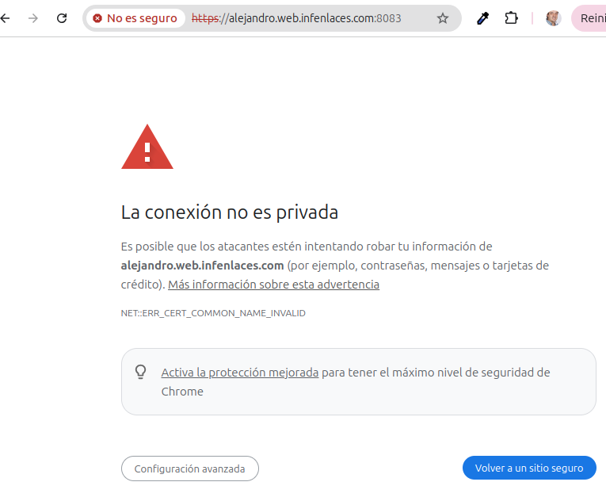
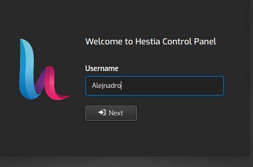
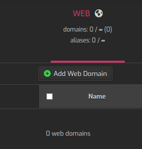

### Usuario creado
Conecto al panel de administrador
 https://web.infenlaces.com:8083 

Por ejemplo un usuario  alejandro 

Aceptamos la conexión no seguro y nos saldrá el menú de acceso

Ahora dentro del panel de administración vamos a crear nuestro sitio web

Creamos uno terminado en web.infenlaces.com para que los dns nos ubiquen en este dominio