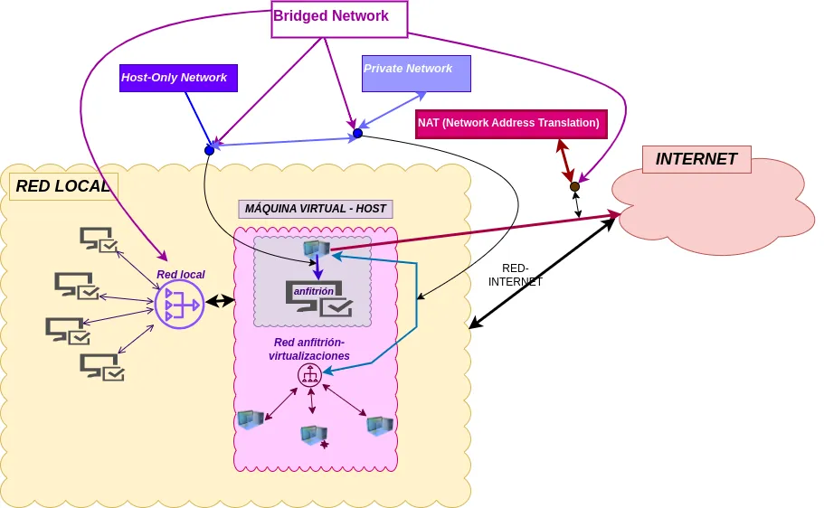


Usar Vagrant  
Revisar fichero de configuración  
Instalar Ubuntu Server  
Conectar o levantar la máquina de Ubuntu para trabajar  


https://web.infenlaces.com/despliegue/contenido/docs/02_linux/


  
{}

### **Comandos básicos de Vagrant**

Para gestionar las máquinas virtuales con Vagrant utilizaremos los siguientes comandos:

1. **Iniciar la máquina virtual**  
   
   vagrant up
   

2. **Conectarse a la máquina virtual**  
   
   vagrant ssh
   

3. **Detener la máquina virtual**  
   
   vagrant halt
   

4. **Reiniciar la máquina virtual**  
   
   vagrant reload
   

5. **Destruir la máquina virtual** (elimina todos los datos asociados):  
   
   vagrant destroy
   

{}

### **Configuración del archivo Vagrantfile**

El siguiente ejemplo de configuración en el archivo `Vagrantfile` instala **Ubuntu Server 24**, mapea puertos para servicios específicos y comparte una carpeta local con la máquina virtual:


Vagrant.configure("2") do |config|
# Configuración de la caja base
config.vm.box = "ubuntu/jammy64"

# Asignar nombre a la máquina virtual
config.vm.hostname = "vagrant-ubuntu24"

# Configurar red y mapeo de puertos
config.vm.network "forwarded_port", guest: 80, host: 8080  # Apache/Nginx
config.vm.network "forwarded_port", guest: 22, host: 2222  # SSH
config.vm.network "forwarded_port", guest: 21, host: 2121  # FTP
config.vm.network "forwarded_port", guest: 53, host: 5353  # DNS

# Compartir una carpeta entre anfitrión y máquina virtual
config.vm.synced_folder "./app", "/var/www/html"

# Configuración del proveedor VirtualBox
config.vm.provider "virtualbox" do |vb|
vb.memory = "1024"
vb.cpus = 2
end
end


{}

### **Notas importantes**


Para que los servicios como Apache o FTP funcionen correctamente en los puertos configurados, asegúrate de instalar y configurar los paquetes necesarios dentro de la máquina virtual.


### Conexiones a la red
Es importante recordad los tipos de conexiónes que establecemos en el fichero Vagrantfile

| **Conexiones**       | **Red Host-VirtualHost** | **Red Local**          | **Internet**          | **Red entre Host y todas las Virtual Host** | **Parámetro de conexión**        |
|-----------------------|--------------------------|-------------------------|------------------------|--------------------------------------------|-----------------------------------|
| **Private Network**   | Sí                      | No                      | No (salvo con NAT)    | Sí                                         | `private_network`                |
| **Host-Only Network** | Sí                      | No                      | No                    | No                                         | Automática (Host-Only)           |
| **Bridged Network**   | Sí                      | Sí                      | Sí                    | No                                         | `public_network`                 |
| **NAT**               | No                      | No                      | Sí                    | No                                         | NAT por defecto                  |

 Explicación 
* **Red Host-VirtualHost**: Conexión directa entre el anfitrión y la máquina virtual.
* **Red Local**: Acceso desde y hacia otros dispositivos en la red local del anfitrión.
* **Internet**: Acceso a Internet desde la máquina virtual.
* **Red** entre Host y todas las Virtual Host: Conexión entre el anfitrión y todas las máquinas virtuales configuradas.
* **Parámetro de conexión**: Configuración utilizada en el archivo Vagrantfile.