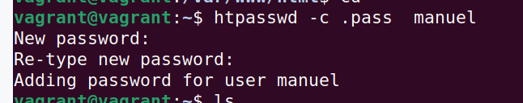
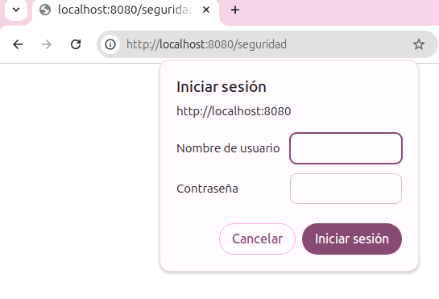
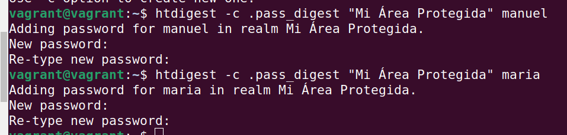


 https://httpd.apache.org/docs/2.4/es/howto/auth.html

{}

Fichero .htaccess
Autenticación basic
Autenticación digest
Autenticación de usuarios
Autenticación de grupo de usuarios

{}
## 1.- El fichero .htacces
Antes de empezar con la autneticación, vamos a ver un fichero de configuración especial en apache:  .htaccess 

En apache podemos configurar a nivel global (afectará a todos los proyectos), o bien podemos establecer una configuracion particular a un directorio y todos sus subdirectorios.

La sigueinte imagen trata de ilustrar este concepto:




El archivo  .htaccess  es un archivo de configuración utilizado en servidores web Apache para aplicar configuraciones específicas a un directorio. 

Este archivo permite modificar ciertos comportamientos del servidor sin necesidad de acceder al archivo principal de configuración  httpd.conf , o el fichero correspondiente  apache2.conf .

### Funciones de `.htaccess`

1. **Control de acceso**:
	- Implementar autenticación (**Basic** y **Digest**).
	- Restringir acceso a usuarios según IP o nombre de usuario.
    - Este tema es objeto de estudio en esta sección

2. **Redirecciones**:
	- Configurar redirecciones 301 (permanentes) y 302 (temporales).
	- Ejemplo:
	  
	  Redirect 301 /antigua-pagina.html /nueva-pagina.html
	  
    - Sencillo de utilizar y a veces práctico

3. **Reescritura de URLs**:
	- Utilizar el módulo `mod_rewrite` para crear URLs amigables.
	- Ejemplo:
	  
	  RewriteEngine On
	  RewriteRule ^pagina-amigable$ pagina-real.php [L]
	  
    - Este apartado se aborda en otra sección

4. **Seguridad**:
	- Proteger directorios con contraseñas.
	- Restringir el acceso según IP:
	  
	  Order Deny,Allow
	  Deny from all
	  Allow from 192.168.1.0/24
	   

5. **Configuraciones específicas**:
	- Establecer una página de error personalizada.
	  
	  ErrorDocument 404 /error-404.html
	  
	- Especificar el archivo predeterminado al acceder a un directorio.
	  
	  DirectoryIndex index.php index.html
	  

### Ventajas de `.htaccess`
- **Flexibilidad**: Permite configuraciones personalizadas para cada directorio.
- **Rapidez**: No requiere reiniciar el servidor para aplicar cambios.

### Desventajas de `.htaccess`
- **Rendimiento**: Apache revisa este archivo en cada solicitud, lo que puede impactar en el rendimiento si se usa excesivamente. Si no es necesario, es importante que no esté. 
- **Seguridad**: Es un fichero de configuración que puede exponer información sensible, por lo que hay que saber bien lo que se está haciendo.

### Activar `.htaccess`
Para que el archivo `.htaccess` funcione, el archivo principal de configuración de Apache (`httpd.conf`) debe permitirlo mediante la directiva `AllowOverride`

Para nuestro ejemplo vamos a establecer un directorio a partir del cual (ese directorio o cualquier otro subdirectorio), si tiene un fichero **_.htaccess_**, se tenga en cuenta y sea leído.    
Si en cualquier otro directorio estuviera ese fichero de configuración **.htaccess**, no se tendrá en cuenta


<Directory /var/www/html/seguridad>
	AllowOverride All
</Directory>


No olvides rebotar el servicio para que la configuracion tenga efecto

sudo apachectl restart


## 2.- Autenticación en Apache

Apache ofrece diferentes métodos de autenticación para proteger recursos en un servidor web. Los más comunes son:
* Basic
* Digest

### 1.- **Autenticación Basic**

La autenticación **Basic** es un método sencillo que solicita al usuario un nombre de usuario y una contraseña. Esta información se transmite codificada en base64 (no cifrada), lo que hace que si queremos  garantizar seguridad,deberíamos de usar HTTPS.

 Configuración de Basic Authentication 

1. **Crear un archivo de contraseñas**:
   Usa el comando `htpasswd` para generar el archivo que almacenará las credenciales:
   
   htpasswd -c /home/vagrant .pass manuel
   
>>  * Este comando creará el fichero llamado **.pass** (establece el nombre que consideres)

>>  * El parámetro `-c` crea el archivo; Si ya existe (para añadir nuevos usuarios), se dede de omitir, ya que si no lo creará de nuevo y se perderán los anteriores.

>>  * El último parámetro es el nombre de usuario, entonces se nos solicatará la password

>>   

3. **Configurar el archivo `.htaccess`**:
   En el directorio que deseas proteger, crea un archivo `.htaccess` con el siguiente contenido:
   
   AuthType Basic
   AuthName "Área Restringida"
   AuthUserFile /ruta/a/.htpasswd
   Require valid-user
   
	- `AuthType Basic`: Especifica el tipo de autenticación.
	- `AuthName`: Mensaje mostrado en el cuadro de diálogo de autenticación.
	- `AuthUserFile`: Ruta al archivo `.htpasswd`.
	- `Require valid-user`: Permite el acceso solo a usuarios válidos.

---

### 2. **Autenticación Digest**

La autenticación **Digest** es más segura que Basic, ya que cifra las credenciales del usuario usando un hash antes de enviarlas. A pesar de ser más seguro por el hecho de que se cifran las credneciales, también se recomienda usar  HTTPS para mayor seguridad.

El proceso es muy similar al visto anteriormente

  Configuración de Digest Authentication 

1. **Crear un archivo de contraseñas para Digest**:
   Usa el comando `htdigest` para crear un archivo de contraseñas:
   
   htdigest -c /ruta/a/.htdigest "Área Restringida" usuario
   
	- `"Área Restringida"`: corresponde al ambito (realm), y su valor, que es obligatorio, debe coincidir con el valor de `AuthName` del fichero de configuración  `.htaccess`.

2. **Configurar el archivo `.htaccess`**:
      En el directorio que deseas proteger, crea un archivo `.htaccess` con el siguiente contenido:
      
      AuthType Digest
      AuthName "Área Restringida"
      AuthDigestProvider file
      AuthUserFile /ruta/a/.htdigest
      Require valid-user
      
       - `AuthType Digest`: Especifica el tipo de autenticación.
       - `AuthDigestProvider file`: Define el proveedor de autenticación (archivo).
       - `AuthUserFile`: Ruta al archivo `.htdigest`.
       - `Require valid-user`: Permite el acceso solo a usuarios válidos (**valid-user**), o podríamos especificar un solo usuario, en tal caso, solo ese usuario, si se identifica correctamente, tendrá acceso.


En ambos casos, **basic** o **digest**,, hay que asegúrarse de que el archivo principal de configuración de Apache permite el uso de `.htaccess`.      
Previamente hemos establecido el valor **all**, pero en realidad sería suficiente con establecer **AuthConfig**, ya que es la única configuración que vamos a establecer en el fichero
	
		<Directory "/var/www/html/seguridad">
			AllowOverride AuthConfig
		</Directory>
	


## 3.- Configuración de usuarios
Ahora queremos utilizar el servidor apache para autenticar recursos a determinados usuarios y/o grupo de usuarios.
Para ello vamos a crear un entorno con una serie de restricciones, según se muestran en la imagen.
* Tenemos 3 grupos de usuarios (contabilidad, informatica y resto)
* Tenemos 4 páginas web (publico.html, contabilidad.html, administracion.html y desarrollo.html)
* Los accesos permitidos son los que se muestran
* Debemos hacerlo tanto con **basic** como con **digest**




#### Configuración de usuarios y grupos

Lo primero que tenemos que hacer es crear los usuarios y grupo en el fichero corresondiente.
Para este comentido, revisamos las directivas importantes del fichero de configuración .htaccess

- AuthUserFile: Ruta al archivo de usuarios.
- AuthGroupFile: Ruta al archivo de grupos.
- Require group: Especifica qué grupo tiene acceso.
- Require user: Especifica qué usuario tiene acceso.
- Require valid-user: Especifica qué cualquier usuario registrado tiene acceso


También es importante revisar los módulos instalados. Para la autenticación de usuarios y grupos necesitamos tener instalados estos módulos:


	mod_authz_groupfile
	mod_authz_user

Se puede revisar con el comando para ver los módulos instalados

apachectl -M 

En caso de no tenerlo (es posible que el de grupo no lo esté por defecto)

	sudo a2enmod authz_groupfile

{}
### Acciones a realizar
1. **Crear un archivo de contraseñas (`.htpasswd`)**, con los usuarios:
   Utiliza el comando `htpasswd` para crear usuarios:
   
        htpasswd -c /home/vagrant/ .htpasswd luis
        htpasswd  /home/vagrant/ .htpasswd lourdes
        htpasswd  /home/vagrant/ .htpasswd teresa
        htpasswd  /home/vagrant/ .htpasswd sonia
        htpasswd  /home/vagrant/ .htpasswd pedro
        htpasswd  /home/vagrant/ .htpasswd mario
   

Observa cómo solo en el primer usuario especificamos **-c** para crear el fichero

   2. **Crear un archivo de grupos (`.htgroup`)**:
      Define grupos y asigna usuarios:
      
        informatica: sonia teresa lourdes
        contabilidad: luis pedro mario
      

Vemos que el fichero de grupos es un fichero de texto que editaremos con nuestro editor (vim, o nano o gedit, ...) y escribimos simplemente las líneas especificadas

3. **Entorno web**
* Debemos crear las carpetas con los ficheros html
* Deben de ser directorios para poder establecer configuración por directorio con el fichero de configuración  .htaccess       
 
     

    

3. **Configurar el archivo `.htaccess`**:
   Configura la autenticación en el directorio deseado, en cada directios establecemos:
   *  administrador      
    En este caso sólo el usuario **luis** puede acceder
         
	     AuthType Basic
	     AuthName "Área Restringida Dirección"
	     AuthUserFile /home/vagrant/.htpasswd
	     Require user luis
         
     *  contabilidad       
      En este caso puede acceder cualquier usuario del grupo de **contabilidad** y la usuaria **lourdes** 

     
       AuthType Basic
       AuthName "Área Restringida de contabilidad"
       AuthUserFile /home/vagrant/.htpasswd
       AuthGroupFile /home/vagrant/.htgroup
       Require group contabilidad
       Require user lourdes
    
     *  informatica       
       En este caso puede acceder cualquier usuario del grupo de **informática** y solo ellos
    
       AuthType Basic
       AuthName "Área Restringida de contabilidad"
       AuthUserFile /home/vagrant/.htpasswd
       AuthGroupFile /home/vagrant/.htgroup
       Require group informatica
    

---

### Notas adicionales

- **Grupos**: Puedes asignar un usuario a múltiples grupos simplemente listándolo en varios grupos dentro del archivo `.htgroup`.
- **Permisos de archivo**: Asegúrate de que los archivos `.htpasswd`, `.htdigest` y `.htgroup` sean accesibles por Apache, pero no por usuarios externos. El usuario apache tiene que tener permiso de ejecución en las carpetas con contengan los ficheros, si no, no podrá acceder a ellos, Si los ficheros están en /var/vagrant: Este comando con **o+x** aplica un permiso de ejecución (+x) al directorio /home/vagrant para el grupo de otros (o), con lo que cualquier puede acceder al directorio, también **www-data**.

sudo chown o+x /home/vagrant 

 
* **Visualiza errores**: si hubiera errores visualiza el fichero de errores de apache2
 
    tail -f /var/log/apache2/error.log

