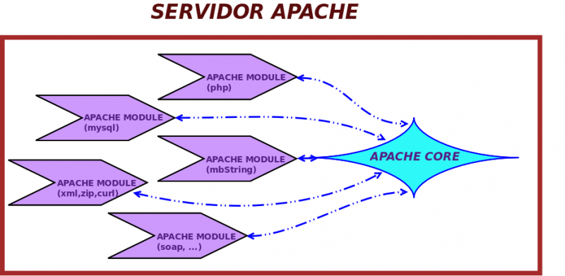


Instalar, configurar y personalizar Apache.
Hosts Virtuales.
Opciones de Directorio.
Alias.
Autenticación en el servidor.
Páginas dinámicas.
SSL.
Rewrite.


### 1.- Introducción
**Apache HTTP Server**, comúnmente conocido como Apache, es uno de los servidores web más utilizados en el mundo.

Como características, podrímos destacar su flexibilidad, estabilidad y gran cantidad de módulos lo convierten en una opción ideal para gestionar servicios web en entornos variados. 

Vemos en la siguiente imagen cómo apache es escalable a través de módulos que podremos ir integrando según vayamos necesitando

{}
En este tema, exploraremos cómo instalar Apache, configurarlo y aprovechar sus funcionalidades clave para implementar servicios web efectivos. También aprenderemos a utilizarlo en un entorno virtualizado con Vagrant, facilitando la práctica en un entorno controlado y replicable.

### 2.- Instalación

Para instalar Apache en sistemas basados en Debian/Ubuntu.


sudo apt update
sudo apt install apache2


Después de la instalación, podemos verificar el estado del servicio:


sudo systemctl status apache2


### 3.- **Archivos de configuración**

 Apache2  en su configuración presenta un sistema descentralizado donde vemos como  organiza su configuración en varios archivos:

- **/etc/apache2/apache2.conf**: Archivo principal de configuración.
- **/etc/apache2/ports.conf**: Define los puertos en los que Apache escucha.
- **/etc/apache2/sites-available/**: Directorios para configuraciones específicas de sitios.
- **/etc/apache2/sites-enabled/**: Enlaces simbólicos a los sitios habilitados.


* Para poder acceder a los ficheros desde un editor, podemos compartir una carpeta y crear un enlace simbólico
* También podríamos conectar por ssh desde nuestro edi. 


### 4.- **Principales herramientas**
1. **apache2**  
   Binario principal para ejecutar el servidor Apache.
2. **apachectl**  
   Interfaz para administrar Apache, recomendada para tareas como iniciar, detener y reiniciar el servidor.
>>  Por lo que se comenta posteriormente, usaremos **apachectl** en lugar de **apache2**, ya que ambas herramientas permiten interactuar con Apache, pero **apachectl** simplifica la administración al abstraer configuraciones y proporcionar comandos específicos como `configtest` o `graceful`, logrando los mismos objetivos de forma más práctica.
>>  **apachectl** simplifica la administración al abstraer configuraciones y proporcionar comandos específicos como `configtest` o `graceful`, logrando los mismos objetivos de forma más práctica.
3. **systemctl**  
   Herramienta para gestionar servicios en sistemas basados en `systemd`.

4. **journalctl**  
   Permite ver logs de Apache gestionados por `systemd`.

5. **service apache2**  
   Comando heredado para manejar servicios, útil en sistemas sin `systemd`.

---

### 5.- **Comandos específicos de Apache**
1. **a2enmod**  
   Activa módulos de Apache.
   
   sudo a2enmod nombre_modulo
   

2. **a2dismod**  
   Desactiva módulos de Apache.

   
   sudo a2dismod nombre_modulo
   

3. **a2ensite**  
   Habilita configuraciones de Virtual Hosts.
   
   sudo a2ensite nombre_sitio
   

4. **a2dissite**  
   Deshabilita configuraciones de Virtual Hosts.

   
   sudo a2dissite nombre_sitio
   

5. **a2enconf**  
   Habilita configuraciones adicionales en Apache.

   
   sudo a2enconf nombre_configuracion
   

6. **a2disconf**  
   Deshabilita configuraciones adicionales.

   
   sudo a2disconf nombre_configuracion
   

### 6.- **Herramientas relacionadas con seguridad y autenticación**
1. **htpasswd**  
   Gestiona archivos de usuarios y contraseñas para autenticación básica.

   
   htpasswd -c /ruta/al/archivo usuario
   

2. **openssl**  
   Genera certificados SSL para configuraciones HTTPS.

   
   openssl req -new -x509 -days 365 -keyout archivo.key -out archivo.crt
   

---

### 7.- **Herramientas adicionales**
1. **logrotate**  
   Gestiona la rotación de logs de Apache para evitar el crecimiento excesivo de archivos.

2. **mod_security**  
   Herramienta para implementar reglas de seguridad web (integrada como módulo en Apache).

3. **ab (Apache Benchmark)**  
   Realiza pruebas de carga en servidores web.
>> Enviamos 100 solicitudas **(-n 100)** con 10 **(-c 10)** conexiones a un url **(http://localhost/)** y vemos estadísticas que genera. 
   
   ab -n 100 -c 10 http://localhost/
   

4. **htcacheclean**  
   Limpia la caché de Apache.
> > Establecemos una limplieza de cache cada 30 segundos de ficheros antiguos o innecesarios en el directorio /var/cache/apache2/proxy que es el que utiliza apache por defecto (Configurable en la directiva CacheRoot). Lo hace en modo bloqueante (por defecto), lo que implica que está activo mientras esté el proceso corriendo.

htcacheclean -d 30 -p /var/cache/apache2/proxy

> > ejemplo de configuración para la cache
> > 
   <IfModule mod_cache_disk.c>
      CacheRoot /var/cache/apache2/proxy
      CacheEnable disk /
      CacheDirLevels 2
      CacheDirLength 1
   </IfModule>
> > 

#### **1. apache2 (binario directo)**
El binario **apache2** permite interactuar directamente con el servidor Apache. Este método es menos común ya que requiere configuraciones específicas.

Usar apache2 directamente,implica que  variables, directorios y configuraciones estén correctamente definidas, y esto no siempre es así
Concretamente:
* **APACHE_RUN_USER** y **APACHE_RUN_GROUP**: Determinan el usuario y grupo bajo los cuales Apache se ejecuta.
* **APACHE_RUN_DIR**: Define el directorio de ejecución donde Apache almacena su PID (por ejemplo, /var/run/apache2).
* **APACHE_LOG_DIR**: Especifica el directorio donde se guardan los logs.
* **APACHE_PID_FILE**: Indica la ubicación del archivo que contiene el ID de proceso (PID) de Apache.




  export APACHE_RUN_USER=www-data
  export APACHE_RUN_GROUP=www-data
  export APACHE_RUN_DIR=/var/run/apache2
  export APACHE_LOG_DIR=/var/log/apache2
  export APACHE_PID_FILE=/var/run/apache2/apache2.pid
  
  Sin embargo, para simplificar la administración, se recomienda utilizar herramientas como:
  
  apachectl.
  systemctl.



> Estas abstraen estas configuraciones y hacen que la experiencia sea más segura y sencilla, **consiguiendo los mismos propósitos**.

**Uso común:**
- **Mostrar ayuda:**


apache2 --help


- **Ver versión:**


apache2 -v


- **Ver detalles de la configuración:**


apache2 -V


- **Verificar sintaxis de configuración:**


apache2 -t


---

#### **2. apachectl (interfaz recomendada para administrar Apache)**
**apachectl** es una interfaz de control que facilita la gestión de Apache.Como ya se ha comentado, su uso es más seguro y práctico que usar directamente el binario.

**Comandos principales:**
- **Ayuda general:**


apachectl -h


- **Iniciar, detener, reiniciar, reiniciar sin interrumpir conexiones activas, ver estado  Apache:**


sudo apachectl start|stop|resetart|graceful|status


- **Verificar configuración:**


sudo apachectl configtest


---

#### **3. systemctl (administración del servicio en sistemas modernos)**
`systemctl` es el comando estándar en sistemas que utilizan `systemd`. Es la forma recomendada para gestionar servicios como Apache.

**Comandos principales:**
- **Iniciar, parar, reiniciar o ver estado del servicio  Apache:**


sudo systemctl start|stop|restart|status apache2


- **Habilitar Apache para que se inicie al arrancar el sistema:**


sudo systemctl enable apache2


- **Deshabilitar Apache del inicio automático:**


sudo systemctl disable apache2


---

#### **4. Otros métodos relevantes**
- **`service` (alternativa más antigua a `systemctl`):**


sudo service apache2 start
sudo service apache2 stop
sudo service apache2 restart


- **`journalctl` (para logs de Apache gestionados por `systemd`):**


sudo journalctl -u apache2


### **Comparación entre apachectl y systemctl**

| Característica                     | `apachectl`                             | `systemctl`                          |
|------------------------------------|-----------------------------------------|--------------------------------------|
| **Propósito**                      | Administra específicamente Apache.      | Administra servicios en general, incluyendo Apache. |
| **Nivel de enfoque**               | Solo para Apache.                       | Para cualquier servicio del sistema. |
| **Comandos básicos**               | start, stop, restart, graceful, configtest. | start, stop, restart, status, enable. |
| **Dependencia de systemd**         | No depende de `systemd`.                | Necesita `systemd` para funcionar.   |
| **Verificación de configuración**  | Incluye opción `configtest`.            | No verifica configuración.           |
| **Simplicidad**                    | Directo y específico para Apache.       | Requiere más comandos para detalles específicos. |

### **Conclusión**
- Ambos comandos logran **los mismos objetivos** en cuanto a iniciar, detener y reiniciar Apache.
- **`apachectl`** es más específico y práctico para tareas relacionadas únicamente con Apache.
- **`systemctl`** es más general y se usa para administrar múltiples servicios en sistemas modernos.

