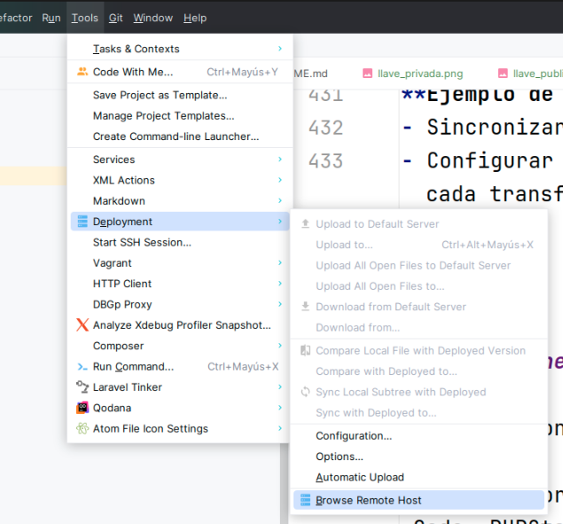
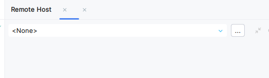
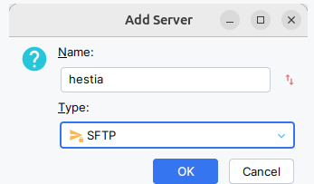


ssh
ficheros de configuración
clave pública y privada
rsync


https://www.openssh.com/manual.html


## SSH (Secure Shell)

SSH es un protocolo que permite iniciar sesiones seguras en máquinas remotas. Utiliza el puerto 22 y su objetivo es establecer conexiones remotas que permitan la transmisión segura de todo tipo de datos. Es parecido a Telnet, con la diferencia de que la información en el caso de SSH se intercambia de forma cifrada.


SSH permite conectarte a una máquina remota de manera segura y evitar que la información sensible sea capturada por sniffers.


 SSH  utiliza técnicas de criptografía para autenticar a los usuarios y garantizar la confidencialidad al cifrar las conexiones entre dispositivos.

Una técnica muy interesante que podemos lograr con SSH es la   tunelización . Crear un túnel una comunicación  consiste en redirigir puertos con el objetivo de que los paquetes enviados en una comunicación puedan atravesar redes que, de otro modo, podrían estarían bloqueadas.

Gracias a SSH, podemos conectarnos a servidores remotos para gestionar infraestructuras y transferir archivos de forma segura.


https://geekland.eu/que-es-y-para-que-sirve-un-tunel-ssh/



## Instalación de SSH
Para instalar un servidor SSH en Ubuntu 24, ejecuta el siguiente comando:
En nuestro caso vamos a utilizar un virtual box configurado con el siguiente fichero de configuración.
Obligatoriamente necesitamos conocer la ip del equipo al que tenemos que conectarnos o bien su nombre, por lo que le vamos a asigar una ip 

Vagrant.configure("2") do |config|
  config.vm.box ="bento/ubuntu-24.04"
  config.vm.network "private_network", ip: "192.168.56.101"
end

Una vez dentro de nuestra máquina procedemos a instalar el **servidor ssh**:  openssh-server , que es un programa que implementa los protocolos  ssh 


sudo apt-get install openssh-server


A continuación, y una vez instalado, vamos a probar a conectarnos desde nuestra máquina.
## Conexión remota con SSH.  
Tenemos diferentes forma de conectar con una máquina usando ssh, vamos a estudiar dos métodos:
{}
1. Usar usuario/password, como en telnet, pero con comunicaciones cifradas.
2. Usar clave publica/privada para la autenticación.
### Conexión usuario / password

 Conexión por usuario y password 

    ssh usuario@ip_maquina

En nuestro caso concreto, solicito conexión y me pedirá el password

    ssh vagrant@192.168.56.101
    vagrant@192.168.56.101's password:

**Nos pide la pass del usuario con el que estamos actualmente**  

> Si este usuario no existe en la máquina, no nos permitirá conectarnos

Si trabajas en windows, tenemos varios programa para ejecutar un cliente ssh, uno de los más conocidos es putty:
> https://www.putty.org/

La mejor opción es abrir un termina de **powershell**, que trae el cliente de **ssh** en línea de comandos y podrás especificar estas mismas acciones.

Una vez conectado nos dará un mensaje de bienvenida:



### Clave pública y privada

 Conectando con clave pública y clave privada 

Este tipo de conexión no requiere que el usuario introduzca una contraseña.

En su lugar, se utiliza **una pareja de claves**:  la clave pública y su clave  privada . 

La clave pública se copia previamente al servidor, y durante la conexión, el servidor valida que la clave privada utilizada corresponda a su pareja la clave pública registrada en el servidor, otorgando o denegando el acceso en función de esta verificación.

**Concepto básico de clave pública y clave privada**

Supongamos que tenemos un candado que podemos abrir y cerrar:




Igualmente tenemos dos llaves mágicas que van en pareja
| Privada                                                      | Pública                                    |
|--------------------------------------------------------------|-------------------------------------------|
|   |                       
|

Entonces el concepto de clave pública y privada funciona del siguiente modo.

 Cuando ciframos un mensaje con una clave privada **solo la clave pública pareja de ella puede abrirlo** 




 Por otro lado si ciframos un mensaje con una clave pública **solo la clave privada  pareja de ella puede abrirlo**





**Este concepto parte de operaciones matemáticas complejas y, en el caso de claves asimétricas, puede involucrar números primos muy grandes y operaciones de una sola dirección**. 

Vamos a exponer, de forma muy básica, la diferencia entre    claves simétricas y asimétricas.  

{}
 Claves simétricas   
{}
Con la misma clave que ciframos, desciframos.

Para comprender el concepto a nivel muy básico, supongamos que tenemos un mensaje: **8**, y lo ciframos con la clave **3** mediante una operación de multiplicar. El mensaje cifrado será **24** _**(8x3).**_

Si alguien tiene el mensaje cifrado y la clave, puede fácilmente realizar la operación inversa para obtener el mensaje original **(24 ÷ 3 = 8)**. Estas **son operaciones reversibles**.

Este tipo de **cifrados son simétricos** y están basados en operaciones reversibles.
> Es fundamental que **la clave no se comparta públicamente**, ya que hacerlo comprometería la confidencialidad y la autenticidad del mensaje original.

{}
 Claves asimétricas 
{}

En este caso, se utilizan dos claves diferentes: **una clave pública y una clave privada**.

Este tipo de cifrado está basado en operaciones matemáticas no reversibles o de una sola dirección. Aunque tengamos el mensaje cifrado y la clave pública utilizada para cifrarlo, no podremos obtener el mensaje original, ya que el descifrado requiere una clave privada diferente.    

Supongamos, de forma muy simplificada, que el mensaje original es **8**, la clave es **3**, y la operación es el módulo (una operación no reversible). Aplicando esta operación, el mensaje cifrado será **2 _(8 modulo 3)_**.

Si tengo la clave pública 3 y el mensaje cifrado 2, hay infinitos posibles mensajes originales que podrían haber generado ese resultado: 11, 15, 18, 20, 23, ....     

> Por esta razón, la clave pública puede compartirse sin comprometer la confidencialidad o autenticidad del mensaje original, ya que solo la clave privada asociada puede descifrarlo.

### Conectando SSH por clave pública/privada

1. **Generamos en nuestro cliente una pareja de clave pública/privada**  
   Para ello, utilizamos el comando **ssh-keygen**. Este comando genera las claves necesarias para autenticar una conexión SSH.

> Durante el proceso de generación, se nos preguntará si queremos proteger la clave privada con una contraseña (passphrase):
> * Si decidimos no usar una  passphrase , el sistema _no pedirá contraseña al utilizar la clave privada_.  
> * Si usamos una   passphrase  , el sistema _nos pedirá la password, cada vez que queramos usar la clave pública/privada_. Podemos evitar que nos la pida repetidamente durante una sesión con el comando **ssh-agent**, que almacena las claves en memoria.

---

{}
**Uso básico (sin parámetros):**

ssh-keygen


**Uso con opciones personalizadas:**

ssh-keygen -t rsa -b 4096 -f $HOME/.ssh/key_vagrant -C "vagrant"

{}

---

 Descripción de los parámetros utilizados

- **`-t rsa`**: Especifica el algoritmo de cifrado (valor por defecto: **RSA**).
- **`-b 4096`**: Define el tamaño de la clave en bits (por defecto: **2048**, recomendado: **4096** para mayor seguridad).
- **`-f ubicación/nombre_fichero`**: Indica la ubicación y el nombre del archivo generado.
    - Se crearán dos archivos:
        - Uno sin extensión: clave privada.
        - Uno con extensión **`.pub`**: clave pública.
- **`-C "vagrant"`**: Añade un comentario a la clave pública para identificarla mejor (por ejemplo, el nombre del usuario o el propósito de la clave).

---

{}

 


 Paso a realizar detallados 
 

# /etc/ssh [15:55:30]
##### nos movemos a nuestro directorio home/.ssh
→ cd $HOME/.ssh

# ~/.ssh [15:55:40]
##### verificamos directorio
→ pwd
/home/manuel/.ssh

# ~/.ssh [15:56:08]
##### generamos las claves
→ ssh-keygen -t rsa -b 4096 -f $HOME/.ssh/key_vagrant -C "vagrant"             
Generating public/private rsa key pair.
Enter passphrase (empty for no passphrase):
Enter same passphrase again:
Your identification has been saved in /home/manuel/.ssh/key_vagrant
Your public key has been saved in /home/manuel/.ssh/key_vagrant.pub
The key fingerprint is:
SHA256:haU9D5+VgfjmmGlwLrG/XCx9achIy2y6nbbvP+dyWfU vagrant
The key's randomart image is:
+---[RSA 4096]----+
|          .. ..  |
|         =. .  o |
|        o =.  o  |
|        o..=oo  .|
|        S*.*+   o|
|        o+**.. .E|
|         +B * + o|
|         =o+ oo.o|
|        oo*=o..*.|
+----[SHA256]-----+
# manuel at pitufin in ~/.ssh [15:57:38]

2. **Copiar la clave pública en el servidor**     

Ahora debemos copiar el fichero que contiene la clave pública al servidor
Para ello podemos usar el comando `scp` que corresponde al copy de ssh

scp $HOME/.ssh/id_rsa.pub vagrant@192.168.56.101:/home/vagrant/..ssh/nombre_pub.pub

3. **Creer el fichero authorized_keys**     
 
Ahora debemos, en el servidor donde hemos copiado el fichero añadir su contenido al fichero `authorized_keys`.
Si no existiese lo crearemos

ssh vagrant@192.168.56.101
## Una vez dentro copiamos el contenido
vagrant@vagrant:~/.ssh$ echo nombre_pub.pub >> authorized_keys  

3. **Usar el comando ssh-copy-id**
* Simplifica la configuración de claves públicas SSH al automatizar la copia y configuración.
* Asegura que los permisos en el servidor remoto sean correctos, evitando problemas con la autenticación.
* Si tienes varios archivos con extensión .pub en tu directorio ~/.ssh, el comando ssh-copy-id seleccionará por defecto el archivo ~/.ssh/id_rsa.pub, siempre y cuando exista.
* No necesitas ejecutar ssh-copy-id desde el directorio $HOME. Puedes ejecutarlo desde cualquier ubicación en tu terminal. ssh-copy-id buscará automáticamente las claves públicas en el directorio ~/.ssh de tu usuario.

  ssh-copy-id vagrant@192.168.56.101
  vagrant@192.168.56.101's password:

   Number of key(s) added: 3
  Now try logging into the machine, with:   "ssh 'vagrant@192.168.56.101'"
   and check to make sure that only the key(s) you wanted were added.



* Después de estas acciones, podremos entrar en el servidor sin necesidad de autenticarnos

  → ssh vagrant@192.168.56.101
  Welcome to Ubuntu 24.04 LTS (GNU/Linux 6.8.0-31-generic x86_64)

......


## Archivos de configuración de SSH
Los archivos principales de configuración de SSH están en el directorio /etc/ssh. Algunos de los más importantes son:

- **sshd_config**: Configuración del servidor SSH.
- **ssh_config**: Configuración del cliente SSH.
- **ssh_host_rsa_key**: Clave RSA privada de la máquina.
- **ssh_host_rsa_key.pub**: Clave RSA pública.
- **~/.ssh/authorized_keys**: Claves públicas autorizadas del usuario.

### Parámetros importantes de configuración
Algunos parámetros relevantes del archivo sshd_config son:

- Port: Puerto de escucha (por defecto, 22).
- PermitRootLogin: Permitir o no conexiones como root.
- AllowUsers: Usuarios autorizados para conectarse.
- X11Forwarding: Permitir ejecución de aplicaciones gráficas.
- PasswordAuthentication: Permitir o no authenticación con password.
- 

### Permitir o denegar el acceso con password

El parámetro PasswordAuthentication es crítico para definir si los usuarios pueden autenticarse mediante contraseñas.

- **Ejemplo para deshabilitar autenticación por contraseña**:
  En el archivo /etc/ssh/sshd_config o en un archivo modular (como /etc/ssh/sshd_config.d/50-cloud-init.conf), añade o modifica la línea:
  
  PasswordAuthentication no|yes  
  


Si usas un archivo modular como **50-cloud-init.conf** los valores definidos allí tendrán prioridad sobre el archivo principal **sshd_config**.


### Especificando un puerto diferente 
Para configurar un puerto distinto por el que el servidor ssh esté escuchando, podificamos esta directiva en el fichero de configuración:

Port 2222


Si el servidor usa un puerto diferente al predeterminado, añade el parámetro-p.   

ssh -p puerto usuario@host


En nuestro caso tenemos dos circunstancias posibles, ya que accedemos desde el anfitrión 
* Que hagamos un forward del puerto del anfitrión al puerto 22 de la máquina virtual.
> Establecemos forward en el VagrantFile de nuestra configuración de virtualización
> 
Vagrant.configure("2") do |config|
config.vm.box ="bento/ubuntu-24.04"
config.vm.network "forwarded_port", guest:22,  host:2222
config.vm.network "private_network", ip: "192.168.56.101"
end

> 
> Ahora recargamos la máquina
> 
vagrant reload

> Y para conectarnos especificamos el puerto a través de localhost
> 
vagrant -p 2222 vagrant@localhost


* Que el servidor ssh esté configurado para escuchar por otro puerto
> En este caso tenemos que modificar parámetros de configuración en el servidor

## Conexión gráfica con X11Forwarding
Habilita la opción X11Forwarding yes en los archivos de configuración del cliente y servidor. Luego, conéctate utilizando:


ssh -X usuario@máquina


Ejecuta una aplicación gráfica como xclock para verificar.

{}
## Transferencia de archivos con SCP
Para copiar archivos de cliente a servidor o viceversa:

- Copiar un archivo al servidor:
  
  scp archivo_local usuario@máquina:archivo_remoto
  

- Copiar un archivo desde el servidor:
  
  scp usuario@máquina:archivo_remoto archivo_local
  
 


Nunca permitas conexiones como root directamente desde SSH 

PermitRootLogin no




### rsync y ssh


`rsync` y `ssh` trabajan juntos para realizar transferencias seguras de archivos.
**rsync** es una herramienta _para copiar archivos_, pero su funcionalidad principal radica en **sincronizar directorios y archivos**.
Esto incluye la capacidad de copiar solo los archivos modificados o de sincronizar datos de manera eficiente entre ubicaciones.

**rsync** Usa el parámetro `-e` para especificar `ssh` como transporte:

rsync -avz -e ssh /ruta/origen usuario@host:/ruta/destino


Se puede usar para realizar despliegues. Por ejemplo estos apuntes los genero en local y voy realizando subidas cada vez que hago cambios, subiendo solo los ficheros modificados

rsync -avz -e "ssh -p 22123" ./public/ admin@web.infenlaces.com:web/web.infenlaces.com/public_html/servicios



Aquí una tabla con opciones para su uso (sacada de https://www.linuxtotal.com.mx/index.php?cont=rsync-manual-de-uso)
| **Opción Corta** | **Opción Larga**          | **Descripción**                                                                                                                                                                    |
|------------------|---------------------------|------------------------------------------------------------------------------------------------------------------------------------------------------------------------------------|
| -a              | --archive                | Modo archive, es igual a indicar las opciones r, l, p, t, g, o y D.                                                                                                               |
| -r              | --recursive              | Recursivo, copia recursivamente los directorios.                                                                                                                                   |
| -l              | --links                  | Cuando encuentra symlinks (enlaces simbólicos), estos son recreados en el destino.                                                                                                |
| -p              | --perms                  | Opción que causa en el destino establecer los permisos igual que en el origen.                                                                                                    |
| -t              | --times                  | Transfiere los tiempos de los archivos (atime, ctime, mtime) al destino.                                                                                                          |
| -g              | --group                  | Establece en el destino que el grupo del archivo copiado sea igual que el origen.                                                                                                 |
| -o              | --owner                  | Establece en el destino que el propietario del archivo copiado sea igual que el origen.                                                                                           |
| -D              |                           | Esto es igual que indicar las opciones --devices y --specials.                                                                                                                    |
|                 | --exclude PATTERN        | Excluye archivos que igualan el patrón o pattern indicado.                                                                                                                        |
|                 | --include PATTERN        | Incluye archivos que igualan el patrón o pattern indicado.                                                                                                                        |
|                 | --devices                | Transfiere archivos de dispositivos de bloque y caracter al destino donde son recreados. Esto solo puede suceder si en el destino se tienen permisos de root.                     |
|                 | --specials               | Transfiere archivos especiales como fifos y named sockets.                                                                                                                        |
|                 | --version                | Indica el número de versión de rsync.                                                                                                                                            |
| -v              | --verbose                | Incrementa la cantidad de información que se informa durante la transferencia o copia de archivos. Es la opción contraria a --quiet.                                              |
| -q              | --quiet                  | Decrementa la cantidad de información que se informa durante la transferencia o copia de archivos. Generalmente se utiliza cuando rsync se utiliza en una tarea cron.              |
| -I              | --ignore-times           | Ignora los tiempos de los archivos y copia todos los archivos, incluso si son iguales en términos de tiempo y tamaño.                                                             |
|                 | --size-only              | Ignora los tiempos de los archivos y transfiere cualquiera con un tamaño distinto en el destino.                                                                                  |
| -n              | --dry-run                | Realiza una prueba de lo que ocurrirá sin realizar cambios. Generalmente se usa junto con --verbose y --itemize-changes.                                                          |
| -i              | --itemize-changes        | Reporta una lista de los cambios realizados en cada archivo, incluidos cambios en sus atributos.                                                                                  |
|                 | --remove-source-files    | Remueve los archivos en el origen (no directorios) si en el destino fueron exitosamente duplicados o copiados.                                                                    |
|                 | --timeout=TIEMPO         | Especifica un timeout en segundos. Si no hay datos transferidos en ese tiempo, rsync terminará.                                                                                    |
|                 | --log-file=ARCHIVO       | Guarda en un archivo lo que se ha realizado.                                                                                                                                      |
|                 | --stats                  | Imprime un conjunto informativo de datos estadísticos sobre la transferencia realizada.                                                                                          |
|                 | --progress               | Muestra el avance o progreso de los archivos que están siendo transferidos.                                                                                                       |
|                 | --bwlimit=KBPS           | Establece un límite de transferencia en kilobytes por segundo. Por defecto es 0 (sin límite).                                                                                     |
|                 | --max-size=TAMAÑO        | No transfiere archivos más grandes que el tamaño indicado.                                                                                                                        |
|                 | --min-size=TAMAÑO        | No transfiere archivos más pequeños que el tamaño indicado.                                                                                                                       |
| -z              | --compress               | Comprime datos durante la transferencia.                                                                                                                                          |

**Ejemplo de uso**:
- Sincronizar archivos locales con un servidor remoto.
- Configurar claves SSH para evitar ingresar la contraseña en cada transferencia.

---

### Conexiones desde un EDI


Un EDI (Entorno de Desarrollo Integrado) como Visual Studio Code, PHPStorm o IntelliJ, permite conexiones directas a servidores mediante SSH.

Ejemplo con phpstorm tenemos la opción en _**Tools=>Deployment=>Browse Remote Host**_

Entonces nos saldrá el menú de conexión:

Ahora podemos poner un nombre a nuestra conexión, y estableceremos la conexión por ssh (spft)

En el menú siguiente podremos establecer los parámetros de conexión , el servidor, usuario, credenciales, que podremos establecer por password o por pareja de claves

---

### Creación de un túnel

Para crear un túnel SSH y redirigir puertos locales o remotos:

ssh -L puerto_local:host_remoto:puerto_remoto usuario@servidor


**Ejemplo práctico**:
- Redirigir el puerto de una base de datos remota a un puerto local:
  
  ssh -L 5432:localhost:5432 usuario@servidor
  

{}

---

### Practicando con Hestia

---

### SFTP


SFTP (SSH File Transfer Protocol) permite transferir archivos de forma segura mediante SSH.


**Cómo usar SFTP**:
1. Conéctate usando:
   
   sftp usuario@servidor
   
2. Comandos básicos:
    - `put`: Subir archivos.
    - `get`: Descargar archivos.
    - `ls`: Listar contenido del directorio remoto.

