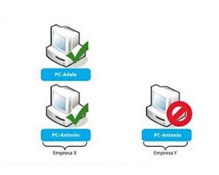
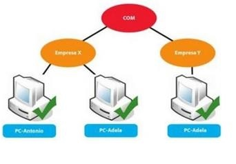
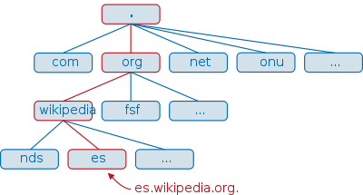
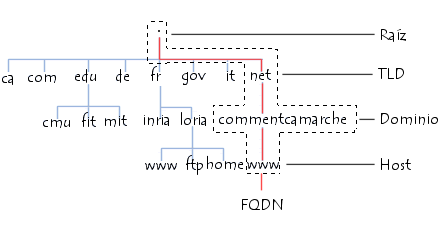
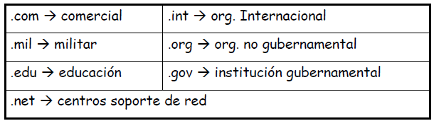
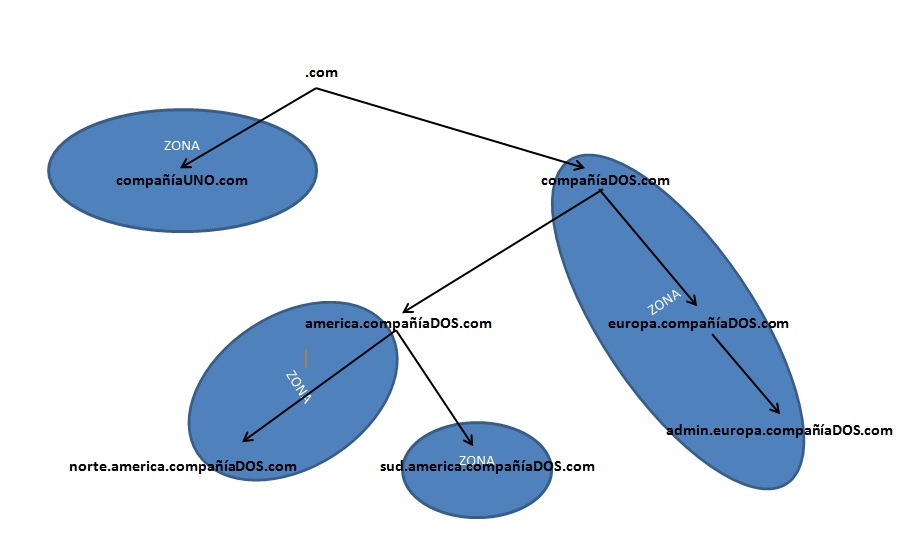
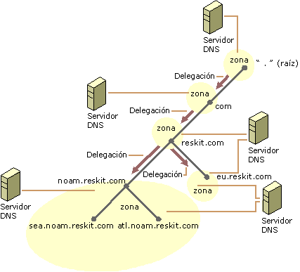
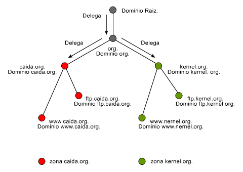
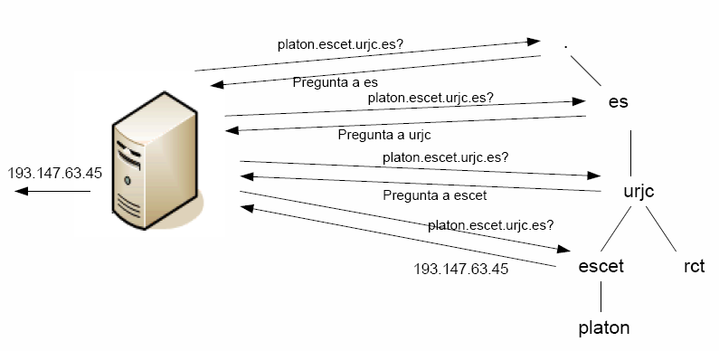
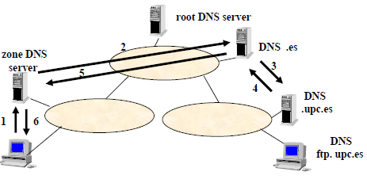


Concepto de DNS
Instalación de servicio o aplicación Bind
Configuración
Puesta en marcha y uso 


{}


- [Documentación oficial de BIND9](https://www.isc.org/bind/)
- [RFC 1034 - Domain Names - Concepts and Facilities](https://tools.ietf.org/html/rfc1034)
- [RFC 1035 - Domain Names - Implementation and Specification](https://tools.ietf.org/html/rfc1035)
  
{}

# Introducción al Servicio DNS


El Sistema de Nombres de Dominio (DNS) es un servicio fundamental en Internet.   
Corresponde a la capa de aplicación y tiene asociado el puerto  52.
Traduce nombres de dominio legibles por humanos en direcciones IP que las máquinas pueden entender y procesar.


## Conceptos Básicos de DNS


- **Servidor DNS**: Software que responde a las consultas de resolución de nombres
- **Registros DNS**: Entradas que asocian nombres con direcciones IP u otros datos
- **Zonas DNS**: Porciones del espacio de nombres de dominio
- **Cache DNS**: Almacenamiento temporal de resoluciones previas


 Protocolos de capa inferior 
DNS utiliza de capas inferiores principalmente UDP, pero también puede usar TCP:
* **Puerto 53 (UDP y TCP)** → Se usa para resolver nombres de dominio en direcciones IP.
* **UDP 53** → Se utiliza principalmente para consultas normales de DNS porque es más rápido y eficiente.
* **TCP 53** → Se usa cuando la respuesta es demasiado grande para caber en un paquete UDP o para operaciones más seguras como transferencias de zona (AXFR/IXFR).

## BIND (Berkeley Internet Name Domain)

 BIND  es el servidor (aplicación que instalaremos) DNS más utilizado en Internet, especialmente en sistemas Unix/Linux. Proporciona una implementación completa del protocolo DNS.
Bind9, implementa el protocolo DNS.    

Basa su funcionamiento en  un  sistema de nombres jerárquico  (vs espacio de nombre planos, que tenemos en el fichero hosts, inmanejable dado el tamaño de internet), que   tiene estructura de árbol  de forma que cada nodo del árbol tiene un significado.    
| Objetivo  |Sistema jerarquizado |
|----------|----------|
| |   |

 El sistema de nombres de dominio  es un sistema de nombres jerárquico y distribuido.

La estructura del sistema de nombres de dominio en una estructura en forma de árbol. Cada nodo del árbol se llama  nombre de dominio  y consiste en una etiqueta de hastac    63 caracteres.

* La raíz del árbol siempre es un **PUNTO**.
* A la etiqueta de segundo nivel se le llama dominio de nivel superior o **Top Level Domain (TLD)**.
* **El extremo de la bifurcación se denomina host** y corresponde a un equipo en la red.



**FQDN (Nombre de Dominio totalmente calificado)**  es la dirección que corresponde con todas las etiquetas de nodo de una estructura arbórea, separadas por puntos y que termina con un punto final.

La profundidad máxima de una estructura arbórea es 127 niveles y la longitud máxima para un nombre FQDN es 255 caracteres.


{}

Por ejemplo el espacio de nombres de los ficheros en disco (se pueden crear ficheros con el mismo nombre siempre que estén en otra carpeta)
A continuación vamos a proceder a instalarlo y configurarlo

**El Centro de Información de la Red Internet (Internet Network Information Center)**  administra  la raíz de la base de datos DNS en Internet.

Los dominios superiores se han asignado a organizaciones y países. Estos nombres de dominio siguen un estándar internacional. Para los países se usan abreviaturas de dos y de tres letras (es, it, de…), y se han reservado varias abreviaturas para que las usen las organizaciones, como se muestra en los siguientes ejemplos:

## Resolución de nombres de dominio
La estructura del árbol, ya comentada anteriormente,está fomrada por nodos interconectos


Cada nodo del árbol de una base de datos DNS, junto con todos los nodos por debajo del mismo

Los dominios pueden contener host (equipos) y otros dominios (subdominios).

Por ejemplo, el dominio Midominio (midominio.com), podría contener a la vez equipos, como host.midominio.com, y subdominios, como subdom.midominio.com, que a su vez podría contener host, como por ejemplo host.subdom.midominio.com.
{}

Equipos  que permiten establecer la relación entre los nombres de dominio y las direcciones IP de los equipos de una red.


 El sistema de servidores de nombres de dominio  es una **arquitectura jeráquica y distribuida**, y permite su administración descentralizada mediante la delegación de dominios. Es decir como no habría un ordenador tan potente como para traducir todos los nombres de todos los ordenadores de Internet, lo que se hizo es que existen **varios servidores DNS** que trabajan de forma _jerárquica y delegándose tareas unos en otros_.  Cada  servidor DNS almacena información acerca de algunas partes del espacio de nombres del dominio. Cada una de esas partes se llama zona. **Se dice el servidor DNS tiene autoridad sobre una o varias zonas**.


La delegación de dominios es el proceso mediante el cual un servidor de nombres de dominio (DNS) transfiere la autoridad de resolución de una parte de un dominio (una zona DNS) a otro servidor.

Esto permite dividir un dominio en subdominios y asignar su gestión a servidores diferentes, manteniendo una estructura jerárquica y distribuida.


{}

{}

{}

Los servidores relacionados con **los dominios de nivel superior (TLD)** se llaman  servidores de dominio de nivel superior . 
Son **13**, están distribuidos por todo el mundo y sus nombres van desde  a.root-servers.net hasta  m.root-servers.net .

### Clasificación de tipos de serividores DNS
Hay 3 tipos de servidores DNS.
*  Servidores primarios (maestros) 
 
> La información de una zona la obtienen de sus archivos locales. Todas las modificaciones sobre una zona (añadir dominios, modificarlos, etc) se llevan a cabo en el servidor primario.
 
*  Servidores secundarios (esclavos) 
 
> Contiene una copia de sólo lectura de los archivos de zona de los servidores maestros con autoridad sobre esas zonas.
 
> Cuando la información del servidor primario cambia, el esclavo la copia para actualizarse. Al proceso mediante el cual se obtiene información actualizada de la zona a través de internet se le llama “transferencia de zona”.
 
*  Servidores caché 
> Cuando se les hace una consulta, si no tiene la respuesta, la reenvían a los servidores que puedan responder. Al recibir la respuesta la almacenan en caché para poder usarla en sucesivas peticiones.
 
> Si se almacena la información en el servidor caché por mucho tiempo, la info puede estar desactualizada, pero si se almacena muy poco tiempo, mayor carga para el sevidor de nombres. Hay que mirar lo que sea mejor para cada caso. Esto es el TTL o Time To Live (Tiempo de vida).

### Proceso de resolución de un nombre de dominio

El proceso de resolución de un nombre de dominio sigue una serie de pasos estructurados que permiten encontrar la dirección IP asociada a un dominio. 

#### 1. Consulta al archivo de hosts local
El sistema operativo primero busca el nombre de dominio en el archivo de configuración local:
- En **Linux/macOS**: `/etc/hosts`
- En **Windows**: `C:\Windows\System32\drivers\etc\hosts`

> Si el dominio se encuentra en este archivo, se usa la dirección IP correspondiente y el proceso termina aquí.

#### 2. Consulta a la caché del sistema y del navegador
Si el dominio no está en el archivo `hosts`, el sistema verifica su **caché DNS local**, en el caso de que  la dirección se haya resuelto recientemente, estará aquí.
* El navegador suele tener  su propia caché DNS, que puede evitar consultas adicionales al sistema operativo.
* El sistema operativo también mantiene una caché DNS local (ejemplo: systemd-resolved en Linux, dnscache en .
 
> Si alguna caché contiene la respuesta, el proceso finaliza aquí.

#### 3. Consulta al servidor DNS configurado

Si el dominio no está en la caché, el sistema consulta el **servidor DNS configurado** (normalmente el del proveedor de Internet o un DNS público como Google `8.8.8.8` o Cloudflare `1.1.1.1`), pero también podría ser un servidor interno.  

 El servidor DNS puede actuar de tres maneras: 
1. **Responder con la dirección IP** si la tiene almacenada en su caché.
2. **Delegar la consulta** a otro servidor DNS si no tiene la información.
3. **Realizar una consulta recursiva** para encontrar la respuesta.

#### 4. Resolución jerárquica en los servidores DNS
Si el servidor DNS consultado no conoce la dirección, sigue el **modelo jerárquico de DNS**:
1. **Servidor raíz (Root DNS)** → Responde con la dirección de los servidores de dominio de nivel superior (TLD, como `.com`, `.org`, `.es`).
2. **Servidor TLD** → Responde con la dirección del servidor autoritativo del dominio solicitado.
3. **Servidor autoritativo** → Contiene la información definitiva sobre el dominio y devuelve la dirección IP.

**Una vez encontrada la dirección, se envía al usuario y se almacena en caché para futuras consultas.**

###  Ejecución iterativa o jerarquica Vs recursiva

Existen **dos tipos de resolución DNS principales**: **iterativa (jerárquica)** y **recursiva**, que quedan establecidas en los puntos 3 y 4 anteriores.

 Resolución iterativa (jerarquizada) 

>Este proceso se basa en que el servidor DNS **no realiza la resolución completa**, sino que va consultando diferentes servidores DNS en la jerarquía hasta obtener una respuesta.

>

> * Flujo del proceso iterativo:
>> 1. **El servidor DNS local consulta un servidor raíz (root DNS).**
>> 2. **El servidor raíz responde con el servidor DNS del dominio de nivel superior (TLD, como .es, .com, .org, etc.).**
>> 3. **El servidor DNS local consulta al servidor del TLD (por ejemplo, el DNS de `.es`).**
>> 4. **El servidor TLD responde con la dirección del servidor DNS del dominio (por ejemplo, `upc.es`).**
>> 5. **El servidor DNS local consulta al servidor DNS autoritativo del dominio (`upc.es`).**
>> 6. **El servidor autoritativo devuelve la dirección IP solicitada.**
>> 7. **El servidor inicial informa al cliente con la dirección IP encontrada.**


En este caso, **el servidor inicial (DNS local) no resuelve directamente el dominio, sino que recibe referencias hasta llegar al servidor autoritativo**.
 

 Resolución recursiva 

> En este caso, el servidor DNS **se encarga de resolver completamente la consulta por el cliente** y solo le devuelve la dirección IP final.

>

>* Flujo del proceso recursivo:

>>1. **El cliente (host) consulta su servidor DNS configurado.**
>>2. **Este servidor DNS consulta a un servidor raíz para obtener la información.**
>>3. **El servidor raíz responde con la dirección del servidor TLD (`.es`).**
>>4. **El servidor DNS consulta al TLD y obtiene la dirección del servidor DNS del dominio (`upc.es`).**
>>5. **El servidor DNS consulta al servidor autoritativo (`ftp.upc.es`) y obtiene la IP.**
>>6. **El servidor DNS devuelve la IP al cliente.**


En este caso, **el cliente solo pregunta una vez y el servidor DNS hace todo el trabajo de resolución hasta obtener la IP**.


---

## 📊 Comparación rápida

| **Tipo de Resolución**      | **Quién resuelve la consulta** | **Proceso** |
|-----------------------------|--------------------------------|-------------|
| **Iterativa (jerárquica)**  | El cliente DNS sigue referencias hasta obtener la respuesta. | El cliente pregunta a varios servidores DNS hasta llegar al autoritativo. |
| **Recursiva**               | El servidor DNS configurado resuelve completamente y responde al cliente. | El cliente solo hace una consulta y el servidor se encarga de todo. |

---

